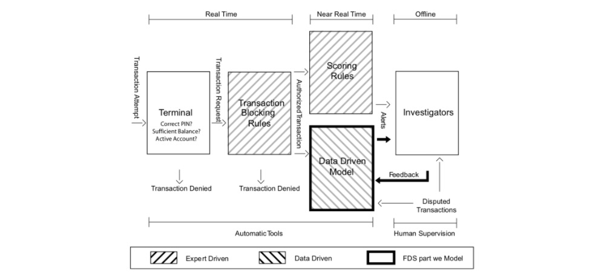
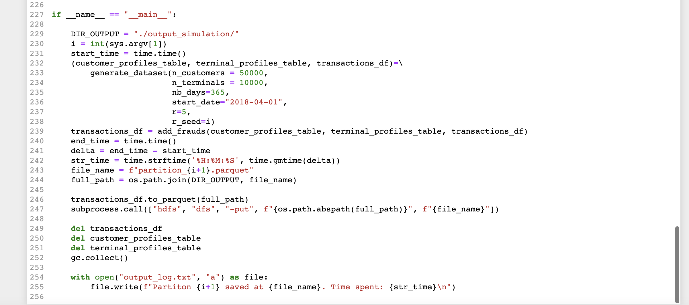

# fraud-detection-ml

# Цели проекта: реализовать ML систему, отвечающую всем требованиям по инфраструктуре, работе и качеству предсказаний.

Мы имеем следующую структуру работы Fraud-Detection приложения. Необходимо улучшить тот блок, который отвечает за Data Driven Model.

Data Driven Model можно разложить таким образом:

То есть необходимо задизайнить такую систему, которая будет способна отвечать этим требованиям.

# Метрики проекта: Precision (на класс FRAUD) и Recall (на класс FRAUD)

Precision (на класс FRAUD) нам необходимо максимизировать так как в мануале есть следующая информация: "Therefore, the primary goal of a DDM is to return precise alerts, as investigators might ignore further alerts when too many false alarms are reported". То есть мы хотим посылать как можно меньше ложных репортов, иначе на них уже могут перестать обращать внимание.

Recall (на класс FRAUD) нам необходимо максимизировать потому как мы сможем определить а насколько хорошо мы определяем между FRAUD транзакции.

Из этого следует что мы можем ориентироваться на F1 меру между двумя этими метриками.

Так же можно смотреть на ROC-AUC, так как для подсчета Precision и Recall требуется трешхолд, который мы заранее не знаем, а ROC-AUC от выбора трешхолда не зависит. Плюс ROC-AUC может помочь выбрать этот трешхолд.

# Задачи по SMART

**Общие задачи**

1. Понять какие данные у нас есть, сколько у нас категориальных и количественных признаков (1 неделя).
2. Изучить то как работает текущий процесс принятия решений, предложить бизнесу свой вариант (1 неделя).
3. Набрать команду разработчиков с продактов, объяснять метрики проекта (1 неделя).

**Задачи по Data Engineering**

1. Настроить Kafka для распределения данных в исторические данные и в поток для обработки в существующей модели (3 недели) (если нужно то поднимать тестовый Hadoop).
2. Настроить Hadoop кластер (HDFS, Spark, YARN, Hive, ZooKeeper) для сохранения данных, добавить совместимость с Kafka (4 недели).
3. Настроить очистку и предобработку данных на уровне, когда они попадают в хранилище HDFS (может на уровне Kafka, может как Spark-Application). (2 недели).

**Задачи по DS/MLops**

1. Настроить Pipeline создания training и validation set по расписанию используя Airflow (1.5 недели). 
2. Настроить единый Pipeline для feature engineering, который будет бейзлайном. Его поведение Data Scientists могут менять локально на ноутбуках и экспериментировать. (2 недели)
3. Настроить Pipeline для обучения модели на training set и затем проверки качества модели на validation set (1.5 недели).
4. Поднять Docker на машине, настроить пути и прочее (1 неделя).
5. Настроить Pipeline для выкладывания модели в production. Она будет в виде Docker-Container, принимающего REST запросы. Контейнер будет делать прогон через Pipeline feautre engineering и затем возвращать итоговые предсказания (3 недели).
6. Настроить Grafana для просмотра состояния сервисов и ключевых метрик проекта (2 недели).
7. Настроить MLFlow для экспериментов Data Scientists (2 недели).

# Настройка Yandex Cloud, генерация fraud транзакций и выгрузка результата в HDFS

**Конфигурация DataProc**

Имеем две датаноды и одну master-node. Для оптимизации можно выделять поменьше оперативной памяти датанодам и повысить это значение для master-node, так как во время генерации случались Out Of memory Exceptions

**Затраты на YC**

Как я сказал, можно уменьшить количества ресурсов для датанод, так как они только хранят информацию на дисках

**Python скрипт для генерации**

Написал следующий python-скрипт для генерации fraud транзакций. Он принимает на вход параметр с номером партиции данных, которую мы хотим сгенерировать и выдает +- 40 млн транзакций

Шелл скрипт, внутри которого запускаются python скрипты (после каждого успешного запуска ресурсы полностью освобождаются). Генерация идет на мастер-ноде.

Файл с результатами генерации, можно посмотреть сколько в среднем занимает генерация по времени (примерно 3 часа)

Результат на HDFS. Фактор репликации 1, значит если какая-то из датанод умрет, то доступа к файлу не будет, поэтому для реальных задачек его стоит ставить 2 или 3.
Так же можно подтюнить размер генерируемого файла, чтобы он умещался в 2 блока (512 MB). Сейчас в среднем там 548 MB, так что мы занимаем по 3 блока на один файл.

